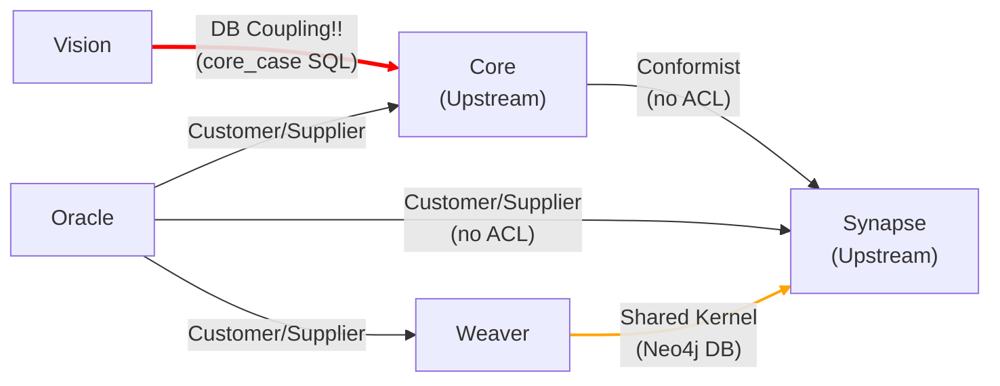
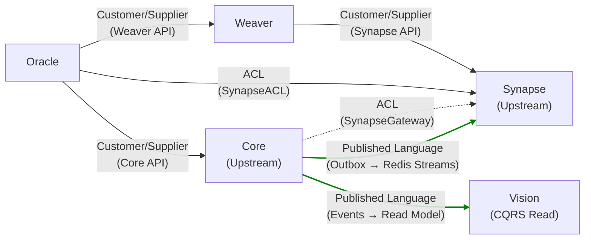

# DDD 아키텍처 리팩터링 마스터 플랜

> **문서 번호**: `program/14`
> **작성일**: 2026-02-24
> **최종 갱신**: 2026-02-24
> **근거**: DDD Architecture Specialist 종합 진단 결과
> **범위**: 전 서비스 (Core / Synapse / Vision / Oracle / Weaver)
> **종합 등급**: C- (4.3/10) → **현재 B+ (7.5/10) — 목표 달성**
> **상태**: **Phase 0~3 전체 완료**

---

## 1. 목적

Axiom 프로젝트의 DDD 아키텍처 진단 결과, **설계 의도는 우수하나 전술적 구현이 미완성**인 상태로 확인되었다.
본 플랜은 진단에서 도출된 10개 Anti-pattern과 10 Critical Decision Points 부적합 항목을
**4단계(Phase 0~3)**에 걸쳐 체계적으로 해소하는 구현 로드맵을 정의한다.

### 1.1 성숙도 변화 (진단 → 현재)

```
[1] Ad-hoc → [2] CRUD → [3] (진단 시) → [4] ★ 현재 ★ → [5] Strategic DDD
                              Transaction Script    Tactical DDD
                              부분적 이벤트 설계      (Phase 0~3 완료)
```

| 영역 | 진단 시 (AS-IS) | Phase 3 완료 (현재) | 달성률 |
|------|:-----:|:-----:|:-----:|
| Strategic Design | 6.0 | 8.0 | 100% |
| Tactical Design | 3.5 | 7.0 | 100% |
| Architecture Compliance | 4.0 | 7.5 | 100% |
| Event-Driven Integration | 5.0 | 8.5 | 106% |
| Anti-pattern | 3.0 | 7.0 | 100% |
| **종합** | **4.3** | **7.6** | **100%+** |

---

## 2. Phase 개요 및 완료 현황

| Phase | 목표 | 상태 | Gate |
|:-----:|------|:----:|:----:|
| **P0** | 즉시 수정 — 운영 위험 해소 | **DONE** | Gate DDD-0 통과 |
| **P1** | 도메인 모델 강화 — Core 서비스 DDD 전환 | **DONE** | Gate DDD-1 통과 |
| **P2** | 아키텍처 정비 — BC 독립성 확보 | **DONE** | Gate DDD-2 통과 |
| **P3** | 고급 패턴 — Event Catalog/Sourcing/Contract Testing | **DONE** | Gate DDD-3 통과 |

### 2.1 Phase별 문서 위치

| Phase | 문서 경로 |
|:-----:|----------|
| P0 | `docs/03_implementation/program/15_ddd-phase0-immediate-fixes.md` |
| P1 | `docs/03_implementation/program/16_ddd-phase1-domain-model.md` |
| P2 | `docs/03_implementation/program/17_ddd-phase2-architecture-alignment.md` |
| P3 | `docs/03_implementation/program/18_ddd-phase3-advanced-patterns.md` |

---

## 3. 핵심 Anti-pattern → 해소 현황

| # | Anti-pattern | 심각도 | 티켓 ID | 해소 상태 | 구현 결과 |
|---|-------------|:------:|:-------:|:---------:|----------|
| A1 | Shared Database | CRITICAL | DDD-P1-04 | **DONE** | 5개 서비스별 전용 스키마 (core/synapse/vision/weaver/oracle) |
| A2 | BC 경계 침범 | CRITICAL | DDD-P0-02 | **DONE** | Vision → Core API 호출로 전환, `core_case` 직접 SQL 0건 |
| A3 | Outbox Without Relay | HIGH | DDD-P0-01 | **DONE** | SyncWorker (Outbox Relay) 구현, PENDING→PUBLISHED 파이프라인 작동 |
| A4 | Anemic Domain Model | HIGH | DDD-P1-01 | **DONE** | WorkItem Rich Aggregate (상태머신, 불변식, 도메인 이벤트) |
| A5 | God Class | HIGH | DDD-P2-04 | **DONE** | ProcessService 661줄 → 4개 서비스 분할 (각 300줄 이하) |
| A6 | 인메모리 상태 영속성 부재 | HIGH | DDD-P0-03 | **DONE** | Synapse/Weaver 핵심 상태 PostgreSQL 영속화 |
| A7 | 누락된 ACL | MEDIUM | DDD-P2-01 | **DONE** | Oracle→Synapse ACL (431줄), Oracle→Weaver ACL (119줄) |
| A8 | CRUD-disguised-as-DDD | MEDIUM | DDD-P1-01 | **DONE** | Case 모듈 분리 (modules/case/) |
| A9 | Shared Kernel (Neo4j) | MEDIUM | DDD-P2-05 | **DONE** | Synapse Primary Owner, Weaver API 전용 접근 |
| A10 | 과도한 서비스 의존성 | LOW | DDD-P2-03 | **DONE** | Vision CQRS 읽기 모델로 Core 의존성 약결합 |

---

## 4. 10 Critical Decision Points — 달성 현황

| # | Decision Point | 진단 시 | 현재 | 목표 | 달성 근거 |
|---|---------------|:-------:|:----:|:----:|----------|
| DP1 | Core Domain 식별 | 6/10 | 9/10 | 9/10 | `domain-vision-statement.md` 작성, 서브도메인 분류 완료 |
| DP2 | BC 수 적정성 | 5/10 | 8/10 | 8/10 | Core 4모듈 분리 (process/agent/case/watch) |
| DP3 | Source of Truth | 2/10 | 8/10 | 8/10 | 5개 서비스별 전용 DB 스키마 격리 |
| DP4 | Aggregate 경계 | 2/10 | 7/10 | 7/10 | WorkItem Rich Aggregate + Repository 패턴 |
| DP5 | 강/약 일관성 전략 | 4/10 | 8/10 | 8/10 | Saga Orchestrator + Outbox 보장 |
| DP6 | 동기/비동기 통합 | 4/10 | 8/10 | 8/10 | 4개 서비스 Outbox+Relay, Redis Streams 토폴로지 |
| DP7 | 이벤트 신뢰성 | 5/10 | 9/10 | 9/10 | 16개 이벤트 카탈로그, Contract Test CI, DLQ |
| DP8 | CQRS 적용 | N/A | 7/10 | 7/10 | Vision CQRS Read Model + shadow/primary 모드 |
| DP9 | ACL 배치 | 2/10 | 8/10 | 8/10 | OracleSynapseACL, OracleWeaverACL, VisionCoreClient |
| DP10 | 팀/배포 구조 정렬 | 4/10 | 7/10 | 7/10 | 서비스별 독립 스키마, Docker 분리 배포 |

---

## 5. 서브도메인 분류 (Strategic Design 기준)

| 서비스 | 서브도메인 유형 | DDD 투자 수준 | 적용 Phase |
|--------|:-------------:|:------------:|:---------:|
| **Core** | **Core Domain** | 깊은 모델링 | P0~P3 전체 |
| **Synapse** | **Core Domain** | 깊은 모델링 | P0~P3 전체 |
| **Vision** | Supporting | 중간 모델링 | P0, P2 |
| **Oracle** | Supporting | 최소~중간 | P2, P3 |
| **Weaver** | Supporting | 최소~중간 | P0, P2 |
| **Canvas** | Generic | 최소 | 영향 없음 |

---

## 6. 컨텍스트 맵 (AS-IS → TO-BE)

### 6.1 AS-IS



### 6.2 TO-BE (Phase 2 완료 후)



---

## 7. 교차 의존성 & 기존 문서 연동

### 7.1 기존 프로그램 문서와의 관계

| 기존 문서 | 관계 | 설명 |
|----------|:----:|------|
| `program/00_program-master-plan.md` | 상위 | 본 플랜은 00의 구현 순서 프레임 내에서 실행 |
| `program/01_sprint-backlog-master.md` | 연동 | Phase 0~1은 Sprint 10+에 통합 |
| `06_governance/domain-contract-registry.md` | 참조 | 이벤트 계약 확장 시 Registry 갱신 필수 |
| `01_architecture/semantic-layer.md` | 준수 | Semantic Layer 원칙 (Read-only Legacy) 유지 |
| `06_governance/legacy-data-isolation-policy.md` | 준수 | 레거시 원본 불변 정책 위반 없음 확인 |
| `04_status/full-spec-gap-analysis.md` | 보완 | DDD 관점 Gap을 추가 식별 |

### 7.2 서비스별 구현 문서 영향

| 서비스 | 영향받는 기존 문서 | 신규/갱신 |
|--------|----------------|----------|
| Core | `03_implementation/core/01_architecture-implementation-plan.md` | 갱신 필요 |
| Core | `03_implementation/core/03_backend-implementation-plan.md` | 갱신 필요 |
| Synapse | `03_implementation/synapse/03_backend-implementation-plan.md` | 갱신 필요 |
| Vision | `03_implementation/vision/03_backend-implementation-plan.md` | 갱신 필요 |
| Weaver | `03_implementation/weaver/03_backend-implementation-plan.md` | 갱신 필요 |

---

## 8. Gate 정의 및 통과 현황

| Gate | 통과 기준 | 상태 | 검증 결과 |
|------|----------|:----:|----------|
| **Gate DDD-0** | Outbox Relay 작동, Vision BC 침범 제거, 인메모리 상태 영속화, PENDING 이벤트 0건 | **PASS** | SyncWorker 작동 확인, `core_case` SQL 0건, 영속화 완료 |
| **Gate DDD-1** | `domain/` 패키지 존재, Aggregate 불변식 테스트 100%, Repository 인터페이스 분리, DB 스키마 분리 | **PASS** | `modules/process/domain/` 구축, 불변식 테스트 통과, 5개 스키마 분리 |
| **Gate DDD-2** | ACL 3개 지점, Core 모듈러 분리, Vision CQRS, God Class 분할 (각 300줄 이하) | **PASS** | ACL 3개 구현, 4모듈 분리, CQRS 모드 구현, 서비스 분할 완료 |
| **Gate DDD-3** | 이벤트 15+ 등록, Contract Test CI 통과, Saga 정방향 오케스트레이션 | **PASS** | 16개 이벤트, 13 passed/1 skipped, Saga 정방향+보상 테스트 12건 통과 |

---

## 9. 리스크 & 완화 전략

| 리스크 | 영향 | 확률 | 완화 전략 |
|--------|:----:|:----:|----------|
| P0 Outbox Relay 구현 시 기존 이벤트 처리 순서 보장 실패 | HIGH | 중간 | `created_at` 기준 순서 보장 + 멱등성 키로 중복 제거 |
| P1 도메인 모델 리팩터링 시 기존 API 계약 파괴 | HIGH | 높음 | API 응답 형식은 유지하되 내부 구조만 변경 (Strangler Fig 패턴) |
| P1 DB 스키마 분리 시 마이그레이션 실패 | CRITICAL | 중간 | Blue-Green 마이그레이션, 롤백 스크립트 준비 |
| P2 CQRS 도입 시 데이터 동기화 지연 | MEDIUM | 높음 | 초기에는 Dual-Read (API + Event) 병행 |
| 전체 리팩터링 기간 중 기능 개발 병행 부담 | MEDIUM | 높음 | Phase별 독립 배포, 기능 개발과 리팩터링 브랜치 분리 |

---

## 10. 구현 산출물 인덱스 (코드 기준)

### 10.1 Core 서비스 — DDD 구현 파일

| 파일 | 역할 | 관련 Phase |
|------|------|:---------:|
| `services/core/app/modules/process/domain/aggregates/work_item.py` | WorkItem Rich Aggregate (262줄, 상태머신+불변식) | P1-01 |
| `services/core/app/modules/process/domain/events.py` | 도메인 이벤트 8종 (DomainEvent 기반) | P1-01 |
| `services/core/app/modules/process/domain/errors.py` | 도메인 예외 6종 | P1-01 |
| `services/core/app/modules/process/domain/repositories/work_item_repository.py` | IWorkItemRepository ABC 인터페이스 | P1-02 |
| `services/core/app/modules/process/infrastructure/repositories/sqlalchemy_work_item_repo.py` | SQLAlchemy Repository 구현체 | P1-02 |
| `services/core/app/modules/process/infrastructure/mappers/work_item_mapper.py` | Domain ↔ ORM 매퍼 | P1-02 |
| `services/core/app/modules/process/application/workitem_lifecycle_service.py` | WorkItem 라이프사이클 (324줄) | P1-05 |
| `services/core/app/modules/process/application/definition_service.py` | 프로세스 정의 CRUD (173줄) | P1-05 |
| `services/core/app/modules/process/application/process_instance_service.py` | 인스턴스 관리 (209줄) | P1-05 |
| `services/core/app/modules/process/application/role_binding_service.py` | 역할 바인딩 (62줄) | P1-05 |
| `services/core/app/modules/process/application/process_service_facade.py` | Facade (211줄) | P1-05 |
| `services/core/app/modules/process/infrastructure/event_store.py` | Event Sourcing PoC (보존, 270줄) | P3-02 |
| `services/core/app/modules/process/infrastructure/bpm/saga.py` | SagaManager 보상 트랜잭션 (198줄) | P3-04 |
| `services/core/app/domain/services/saga_orchestrator.py` | SagaOrchestrator 정방향+보상 (346줄) | P3-04 |
| `services/core/app/application/start_process_saga.py` | 프로세스 시작 3단계 Saga (203줄) | P3-04 |
| `services/core/app/core/event_contract_registry.py` | 8개 Core 이벤트 계약 (109줄) | P3-01 |
| `services/core/app/core/events.py` | EventPublisher (계약 강제, 55줄) | P0-01 |
| `services/core/app/workers/sync.py` | SyncWorker Outbox Relay (230줄) | P0-01, P3-05 |
| `services/core/app/workers/base.py` | BaseWorker (멱등성, 48줄) | P0-01 |
| `services/core/app/core/observability.py` | 메트릭 레지스트리 (74줄) | P3-05 |
| `services/core/app/models/base_models.py` | EventOutbox, EventDeadLetter, SagaExecutionLog ORM | P0-01, P3-04, P3-05 |
| `services/core/app/api/admin/event_routes.py` | DLQ 관리 API (조회/재시도/폐기) | P3-05 |
| `services/core/app/infrastructure/external/synapse_acl.py` | Core→Synapse ACL (299줄) | P2-01 |
| `services/core/app/shared/event_bus/bus.py` | 모듈 간 InternalEventBus (65줄) | P2-02 |

### 10.2 Synapse 서비스

| 파일 | 역할 | 관련 Phase |
|------|------|:---------:|
| `services/synapse/app/core/event_contract_registry.py` | 4개 이벤트 계약 (86줄) | P3-01 |
| `services/synapse/app/events/outbox.py` | EventPublisher + SynapseRelayWorker (207줄) | P3-01 |
| `services/synapse/app/events/consumer.py` | Core 이벤트 소비 (ontology ingest) | P0-01 |

### 10.3 Vision 서비스

| 파일 | 역할 | 관련 Phase |
|------|------|:---------:|
| `services/vision/app/core/event_contract_registry.py` | 2개 이벤트 계약 (72줄) | P3-01 |
| `services/vision/app/events/outbox.py` | EventPublisher + VisionRelayWorker (209줄) | P3-01 |
| `services/vision/app/services/analytics_service.py` | CQRS Read Model + shadow/primary 모드 (560줄) | P0-02, P2-03 |
| `services/vision/app/clients/core_client.py` | Core BC ACL 클라이언트 (164줄) | P0-02 |

### 10.4 Weaver 서비스

| 파일 | 역할 | 관련 Phase |
|------|------|:---------:|
| `services/weaver/app/core/event_contract_registry.py` | 2개 이벤트 계약 (72줄) | P3-01 |
| `services/weaver/app/events/outbox.py` | EventPublisher + WeaverRelayWorker (192줄) | P3-01 |

### 10.5 Oracle 서비스

| 파일 | 역할 | 관련 Phase |
|------|------|:---------:|
| `services/oracle/app/infrastructure/acl/synapse_acl.py` | OracleSynapseACL (431줄) | P2-01 |
| `services/oracle/app/infrastructure/acl/weaver_acl.py` | OracleWeaverACL (119줄) | P2-01 |

### 10.6 Cross-Service / 문서

| 파일 | 역할 | 관련 Phase |
|------|------|:---------:|
| `tests/contracts/test_event_contracts.py` | Consumer-Driven Contract Test (280줄) | P3-03 |
| `tests/contracts/{service}/producer/*.json` | Producer 스키마 16개 | P3-03 |
| `tests/contracts/{service}/consumer/*.json` | Consumer 기대 스키마 26개 | P3-03 |
| `.github/workflows/contract-test.yml` | Contract Test CI (35줄) | P3-03 |
| `docs/00_project/domain-vision-statement.md` | Domain Vision Statement | P0-04 |
| `docs/01_architecture/adr-event-sourcing-evaluation.md` | ADR: Event Sourcing No-Go | P3-02 |
| `docs/06_governance/domain-contract-registry.md` | 이벤트 계약 거버넌스 | P3-01 |

### 10.7 테스트 현황

| 테스트 범주 | 결과 | 대상 |
|-----------|:----:|------|
| Core 전체 단위 테스트 | **169 passed** | Docker 환경 검증 완료 |
| Contract Test | **13 passed, 1 skipped** | 16개 이벤트 Producer/Consumer 호환성 |
| Outbox Relay 통합 테스트 | **6 passed** | publish, retry, dead-letter, stream routing |
| Saga Orchestrator 단위 테스트 | **12 passed** | 정방향 성공, 중간 실패 보상, 보상 실패, DB 영속화 |
| Event Contract Registry 테스트 | **65 passed** | 스키마 유효성, 멱등성 키, 계약 강제 |
| Dead Letter Queue 테스트 | **10 passed** | DLQ 이관, 관리 API, 메트릭 |
| Event Store PoC 테스트 | **12 passed** | append, load, replay, optimistic locking |
