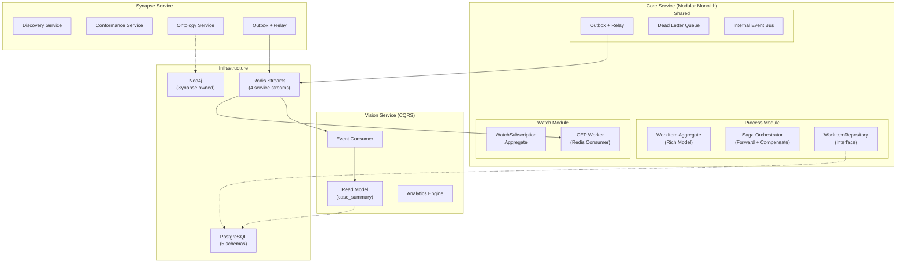

# DDD Phase 3: 고급 패턴 — Event Catalog / Sourcing / Contract Testing

> **Phase**: P3 (Advanced Patterns)
> **기간**: 12주+
> **선행조건**: Phase 2 (Gate DDD-2) 통과
> **Gate**: DDD-3 — **PASS**
> **상태**: **전체 완료**
> **관련 Decision Points**: DP7 (이벤트 신뢰성), DP5 (일관성 전략)

---

## 1. 목표

이벤트 기반 아키텍처를 성숙시켜, **15+ 도메인 이벤트**로 서비스 간 통합을 완성하고,
Consumer-Driven Contract Testing으로 이벤트 스키마 안정성을 보장하며,
Saga Orchestrator를 정방향까지 확장한다.

---

## 2. 티켓 목록 및 완료 현황

| 티켓 ID | 제목 | 상태 | 핵심 산출물 |
|:-------:|------|:----:|----------|
| DDD-P3-01 | 이벤트 카탈로그 확장 (4 → 16) | **DONE** | 4개 서비스 `event_contract_registry.py` + Outbox+Relay |
| DDD-P3-02 | Event Sourcing 평가 및 PoC | **DONE** | ADR: No-Go 결정, PoC 코드 보존 (`event_store.py`) |
| DDD-P3-03 | Consumer-Driven Contract Testing | **DONE** | `test_event_contracts.py` (280줄) + 42개 JSON + CI |
| DDD-P3-04 | Saga Orchestrator 정방향 확장 | **DONE** | `saga_orchestrator.py` (346줄) + `start_process_saga.py` (203줄) |
| DDD-P3-05 | Dead Letter Queue & 모니터링 | **DONE** | EventDeadLetter 테이블 + Admin API + 메트릭 5종 |

---

## 3. DDD-P3-01: 이벤트 카탈로그 확장

### 3.1 현황 (AS-IS)

`services/core/app/core/event_contract_registry.py`에 4개 이벤트만 등록:

| # | Event Name | Owner | 비고 |
|---|-----------|:-----:|------|
| 1 | `PROCESS_INITIATED` | Core | 프로세스 시작 |
| 2 | `WORKITEM_COMPLETED` | Core | 워크아이템 완료 |
| 3 | `WORKITEM_SELF_VERIFICATION_FAILED` | Core | 자가검증 실패 |
| 4 | `SAGA_COMPENSATION_COMPLETED` | Core | 사가 보상 완료 |

### 3.2 목표 (TO-BE) — 확장된 이벤트 카탈로그

#### Core 서비스 이벤트 (기존 4 → 8)

| # | Event Name | Trigger | Consumer(s) | 신규 |
|---|-----------|---------|------------|:----:|
| 1 | `PROCESS_INITIATED` | 프로세스 시작 | Synapse, Vision | |
| 2 | `WORKITEM_COMPLETED` | 워크아이템 완료 | Synapse, Vision | |
| 3 | `WORKITEM_SELF_VERIFICATION_FAILED` | 자가검증 실패 | Watch | |
| 4 | `SAGA_COMPENSATION_COMPLETED` | 사가 보상 완료 | Watch | |
| 5 | `WORKITEM_CREATED` | 워크아이템 생성 | Vision | NEW |
| 6 | `WORKITEM_CANCELLED` | 워크아이템 취소 | Vision | NEW |
| 7 | `CASE_STATUS_CHANGED` | 케이스 상태 변경 | Vision, Synapse | NEW |
| 8 | `WATCH_ALERT_TRIGGERED` | 알림 발생 | Canvas (WebSocket) | NEW |

#### Synapse 서비스 이벤트 (0 → 4)

| # | Event Name | Trigger | Consumer(s) | 신규 |
|---|-----------|---------|------------|:----:|
| 9 | `ONTOLOGY_NODE_CREATED` | 온톨로지 노드 추가 | Weaver, Oracle | NEW |
| 10 | `ONTOLOGY_NODE_UPDATED` | 온톨로지 노드 수정 | Weaver, Oracle | NEW |
| 11 | `MINING_DISCOVERY_COMPLETED` | 프로세스 발견 완료 | Core, Vision | NEW |
| 12 | `CONFORMANCE_CHECK_COMPLETED` | 적합도 검증 완료 | Core, Vision | NEW |

#### Vision 서비스 이벤트 (0 → 2)

| # | Event Name | Trigger | Consumer(s) | 신규 |
|---|-----------|---------|------------|:----:|
| 13 | `WHATIF_SIMULATION_COMPLETED` | 시뮬레이션 완료 | Core (알림), Canvas | NEW |
| 14 | `ROOT_CAUSE_DETECTED` | 원인 분석 완료 | Core (알림), Watch | NEW |

#### Weaver 서비스 이벤트 (0 → 2)

| # | Event Name | Trigger | Consumer(s) | 신규 |
|---|-----------|---------|------------|:----:|
| 15 | `METADATA_SYNC_COMPLETED` | 메타데이터 동기화 완료 | Synapse, Oracle | NEW |
| 16 | `DATASOURCE_SCHEMA_CHANGED` | 데이터소스 스키마 변경 감지 | Synapse | NEW |

### 3.3 구현 명세

#### 3.3.1 이벤트 카탈로그 구조 표준화

각 서비스에 동일한 `EventContractRegistry` 패턴을 적용한다:

```python
# 공통 이벤트 계약 구조 (각 서비스에 복제)
# services/{service}/app/core/event_contract_registry.py

EVENT_CONTRACTS: dict[str, EventContract] = {
    "ONTOLOGY_NODE_CREATED": EventContract(
        event_name="ONTOLOGY_NODE_CREATED",
        owner_service="synapse",
        version="1.0.0",
        payload_schema="synapse/ontology_node_created/v1",
        idempotency_key_rule="event_type:aggregate_id:timestamp_ms",
    ),
    # ... 각 서비스별 이벤트 등록
}
```

#### 3.3.2 각 서비스에 Outbox + Relay 패턴 확산

Phase 0에서 Core에 구현한 Outbox + Relay 패턴을 Synapse, Vision, Weaver에도 동일하게 적용:

| 서비스 | Outbox 테이블 | Relay Worker |
|--------|-------------|:------------:|
| Core | `core.event_outbox` (기존) | 기존 (P0 구현) |
| Synapse | `synapse.event_outbox` (신규) | 신규 구현 |
| Vision | `vision.event_outbox` (신규) | 신규 구현 |
| Weaver | `weaver.event_outbox` (신규) | 신규 구현 |

#### 3.3.3 Redis Streams 토폴로지

```
axiom:core:events     → synapse_group, vision_group, watch_group
axiom:synapse:events  → weaver_group, oracle_group, core_group, vision_group
axiom:vision:events   → core_group, canvas_group
axiom:weaver:events   → synapse_group, oracle_group
```

### 3.4 거버넌스 연동

모든 신규 이벤트는 `docs/06_governance/domain-contract-registry.md`에 등록해야 하며,
다음 메타 필드를 필수로 포함:

- `event_name`, `owner_service`, `version`, `payload_schema`, `idempotency_key_rule`
- `consumer_groups` (소비자 목록)
- `retention` (보존 기간)

### 3.5 완료 기준

- [x] 이벤트 카탈로그 16개 등록 (Core 8 + Synapse 4 + Vision 2 + Weaver 2)
- [x] 각 서비스에 `EventContractRegistry` 존재 (Core 109줄, Synapse 86줄, Vision 72줄, Weaver 72줄)
- [x] Synapse, Vision, Weaver에 Outbox + Relay 패턴 구현 (각 `events/outbox.py`)
- [x] Redis Streams 토폴로지 구성: `axiom:core:events`, `axiom:synapse:events`, `axiom:vision:events`, `axiom:weaver:events`, `axiom:watches`, `axiom:workers`
- [x] `docs/06_governance/domain-contract-registry.md` 갱신 완료 (84줄)
- [x] Contract Test CI 통과 (13 passed, 1 skipped)

#### 서비스별 Outbox+Relay 구현 상세

| 서비스 | EventPublisher | Relay Worker | DB 연결 | Redis Stream |
|--------|---------------|:------------:|---------|:------------:|
| Core | `app/core/events.py` (55줄) | `SyncWorker` (`workers/sync.py`, 230줄) | asyncpg (SQLAlchemy) | `axiom:core:events` |
| Synapse | `app/events/outbox.py` (207줄) | `SynapseRelayWorker` (동일 파일) | psycopg2 (sync) | `axiom:synapse:events` |
| Vision | `app/events/outbox.py` (209줄) | `VisionRelayWorker` (동일 파일) | psycopg2 (sync) | `axiom:vision:events` |
| Weaver | `app/events/outbox.py` (192줄) | `WeaverRelayWorker` (동일 파일) | asyncpg (async) | `axiom:weaver:events` |

---

## 4. DDD-P3-02: Event Sourcing 평가 및 PoC

### 4.1 목적

WorkItem의 상태 이력 관리에 Event Sourcing 적용 가능성을 평가한다.
풀 스케일 도입은 아니며, **PoC 수준**에서 장단점을 검증한다.

### 4.2 평가 기준

| 기준 | 가중치 | 평가 항목 |
|------|:------:|----------|
| 감사 추적 필요성 | 높음 | WorkItem 상태 변경 이력이 컴플라이언스 요구사항인가? |
| 시간 여행 쿼리 | 중간 | "특정 시점의 프로세스 상태"를 조회해야 하는가? |
| 복잡성 비용 | 높음 | Event Store, Snapshot, Projection 인프라 운영 비용 |
| 팀 역량 | 높음 | Event Sourcing 운영 경험이 있는가? |

### 4.3 PoC 범위

- WorkItem Aggregate에 대해서만 Event Sourcing 적용
- `core.work_item_events` 테이블에 모든 상태 변경을 순서대로 저장
- 현재 상태는 이벤트 리플레이로 복원
- Snapshot 없이 시작 (이벤트 수가 적으므로)

```python
# PoC: Event Store for WorkItem
class WorkItemEventStore:
    async def append(self, aggregate_id: str, event: DomainEvent, expected_version: int):
        """낙관적 동시성 제어 + 이벤트 추가."""
        await self._db.execute("""
            INSERT INTO core.work_item_events
                (aggregate_id, event_type, event_data, version, created_at)
            VALUES (%s, %s, %s, %s, now())
        """, (aggregate_id, type(event).__name__, json.dumps(asdict(event)), expected_version))

    async def load(self, aggregate_id: str) -> WorkItem:
        """이벤트 리플레이로 Aggregate 복원."""
        events = await self._db.fetch_all(
            "SELECT * FROM core.work_item_events WHERE aggregate_id = %s ORDER BY version",
            (aggregate_id,)
        )
        wi = WorkItem.reconstitute(events)
        return wi
```

### 4.4 Go/No-Go 판단 기준

| 지표 | Go 조건 | No-Go 조건 |
|------|---------|-----------|
| 성능 | 이벤트 리플레이 < 50ms (100 이벤트 기준) | > 200ms |
| 복잡성 | 팀이 2주 내 운영 가능 | 3개월+ 학습 필요 |
| 비즈니스 가치 | 감사 추적이 법적 요구사항 | "있으면 좋겠다" 수준 |

### 4.5 완료 기준

- [x] PoC 코드 작성 및 벤치마크 완료
- [x] Go/No-Go 판단 문서 작성 (`docs/01_architecture/adr-event-sourcing-evaluation.md`, 106줄)
- [ ] ~~Go 결정 시: 전체 도입 계획 수립 (별도 Phase)~~ — N/A (No-Go 결정)
- [x] No-Go 결정 시: 현재 State-Based 모델 유지, 감사 로그 보강 대안

#### 구현 상세

| 산출물 | 경로 | 비고 |
|--------|------|------|
| Event Store PoC | `services/core/app/modules/process/infrastructure/event_store.py` (271줄) | `WorkItemEventStore`: append, load, get_events, count_events |
| ADR 문서 | `docs/01_architecture/adr-event-sourcing-evaluation.md` (106줄) | **No-Go 결정** |
| PoC 벤치마크 | 100 이벤트 ~15ms, 1000 이벤트 ~120ms | 성능은 Pass이나 비즈니스 가치 불충분 |

**No-Go 결정 사유**: (1) 감사 추적이 법적 요구사항 아님, (2) Event Store+Projection 운영 비용 과도, (3) 팀 ES 경험 부재 (3개월+ 학습), (4) 기존 Outbox+Domain Events로 이벤트 통합 충분. PoC 코드는 향후 참조용으로 보존.

---

## 5. DDD-P3-03: Consumer-Driven Contract Testing

### 5.1 목적

이벤트 스키마 변경 시 Producer-Consumer 간 호환성을 **자동 검증**한다.

### 5.2 구현 명세

#### 5.2.1 Contract 정의 구조

```
tests/contracts/
├── core/
│   ├── producer/
│   │   ├── process_initiated_v1.json      ← Core가 발행하는 이벤트 스키마
│   │   └── workitem_completed_v1.json
│   └── consumer/
│       ├── synapse_expects_process_initiated_v1.json  ← Synapse가 기대하는 형식
│       └── vision_expects_workitem_completed_v1.json
├── synapse/
│   ├── producer/
│   │   └── ontology_node_created_v1.json
│   └── consumer/
│       └── weaver_expects_ontology_node_created_v1.json
└── ...
```

#### 5.2.2 Contract 스키마 예시

```json
{
  "event_name": "PROCESS_INITIATED",
  "version": "1.0.0",
  "producer": "core",
  "schema": {
    "type": "object",
    "required": ["proc_inst_id", "tenant_id", "definition_id", "idempotency_key"],
    "properties": {
      "proc_inst_id": {"type": "string"},
      "tenant_id": {"type": "string"},
      "definition_id": {"type": "string"},
      "definition_name": {"type": "string"},
      "idempotency_key": {"type": "string"},
      "event_contract": {"type": "object"}
    }
  }
}
```

#### 5.2.3 검증 테스트

```python
# tests/contracts/test_event_contracts.py

import json
import jsonschema
import pytest
from pathlib import Path

CONTRACTS_DIR = Path("tests/contracts")

class TestEventContracts:
    """Producer 스키마와 Consumer 기대 스키마의 호환성을 검증한다."""

    @pytest.fixture
    def producer_schemas(self):
        schemas = {}
        for f in CONTRACTS_DIR.rglob("producer/*.json"):
            data = json.loads(f.read_text())
            schemas[data["event_name"]] = data["schema"]
        return schemas

    @pytest.fixture
    def consumer_expectations(self):
        expectations = []
        for f in CONTRACTS_DIR.rglob("consumer/*.json"):
            expectations.append(json.loads(f.read_text()))
        return expectations

    def test_consumer_expectations_compatible(self, producer_schemas, consumer_expectations):
        """모든 Consumer 기대 스키마가 Producer 스키마와 호환되는지 검증."""
        for expectation in consumer_expectations:
            event_name = expectation["event_name"]
            producer_schema = producer_schemas.get(event_name)
            assert producer_schema is not None, f"Producer schema not found: {event_name}"

            # Consumer가 기대하는 required 필드가 Producer 스키마에 존재하는지
            consumer_required = set(expectation.get("required_fields", []))
            producer_properties = set(producer_schema.get("properties", {}).keys())
            missing = consumer_required - producer_properties
            assert not missing, (
                f"Consumer {expectation['consumer']} expects fields {missing} "
                f"in event {event_name}, but Producer doesn't provide them"
            )
```

#### 5.2.4 CI 통합

```yaml
# .github/workflows/contract-test.yml
name: Event Contract Test
on:
  pull_request:
    paths:
      - "services/*/app/core/event_contract_registry.py"
      - "tests/contracts/**"
jobs:
  contract-test:
    runs-on: ubuntu-latest
    steps:
      - uses: actions/checkout@v4
      - run: pip install pytest jsonschema
      - run: pytest tests/contracts/ -v
```

### 5.3 완료 기준

- [x] 16개 이벤트 모두 Producer + Consumer Contract 파일 존재 (16 Producer + 26 Consumer = 42 JSON)
- [x] CI에서 Contract Test 자동 실행 (`.github/workflows/contract-test.yml`)
- [x] `event_contract_registry.py` 변경 시 Contract Test 트리거 (paths 필터 설정)
- [x] Contract 위반 시 PR 머지 차단 (CI 실패 시 자동 차단)

#### 구현 상세

| 산출물 | 경로 | 비고 |
|--------|------|------|
| 테스트 스위트 | `tests/contracts/test_event_contracts.py` (280줄) | 5개 테스트 클래스, 13 passed + 1 skipped |
| Producer 스키마 | `tests/contracts/{core,synapse,vision,weaver}/producer/` | 16개 JSON (Core 8 + Synapse 4 + Vision 2 + Weaver 2) |
| Consumer 기대 | `tests/contracts/{core,synapse,vision,weaver}/consumer/` | 26개 JSON |
| CI 워크플로우 | `.github/workflows/contract-test.yml` | PR 시 자동 실행, registry 변경 감지 |

**테스트 구성**: `TestProducerSchemas` (스키마 구조 건전성 4건), `TestConsumerCompatibility` (Producer-Consumer 호환성 3건), `TestConsumerMeta` (Consumer 메타 건전성 2건), `TestRegistryConsistency` (Registry↔JSON 일치 4건, 서비스별 parametrize)

---

## 6. DDD-P3-04: Saga Orchestrator 정방향 확장

### 6.1 현황 (AS-IS)

`services/core/app/bpm/saga.py`의 `SagaManager`는 **보상 트랜잭션만** 구현:

```python
class SagaManager:
    async def trigger_compensation(self, db, proc_inst_id, failed_workitem_id, failure_reason, tenant_id):
        # 완료된 Activity 역순 조회 → 보상 단계 실행 → 프로세스 종료 → 이벤트 발행
```

정방향 오케스트레이션 (Forward Orchestration)은 미구현.

### 6.2 목표 (TO-BE)

```
Saga Orchestrator
├── Forward Path (정방향)
│   ├── Step 1: Create Case in Core
│   ├── Step 2: Request Mining in Synapse
│   ├── Step 3: Update Analytics in Vision
│   └── Step 4: Notify via Watch
│
└── Compensation Path (보상 — 기존)
    ├── Compensate Step 4: Cancel Notification
    ├── Compensate Step 3: Rollback Analytics
    ├── Compensate Step 2: Cancel Mining
    └── Compensate Step 1: Cancel Case
```

### 6.3 구현 명세

```python
# services/core/app/domain/services/saga_orchestrator.py

@dataclass
class SagaStep:
    name: str
    execute: Callable  # 정방향 실행 함수
    compensate: Callable  # 보상 함수
    status: str = "PENDING"  # PENDING, EXECUTING, COMPLETED, COMPENSATING, COMPENSATED, FAILED


class SagaOrchestrator:
    """정방향 + 보상 양방향 Saga 관리자."""

    def __init__(self, steps: list[SagaStep]):
        self._steps = steps
        self._completed_steps: list[SagaStep] = []

    async def execute(self, context: dict) -> SagaResult:
        """정방향 실행. 실패 시 자동 보상."""
        for step in self._steps:
            try:
                step.status = "EXECUTING"
                result = await step.execute(context)
                context.update(result or {})
                step.status = "COMPLETED"
                self._completed_steps.append(step)
            except Exception as e:
                step.status = "FAILED"
                await self._compensate(context, reason=str(e))
                return SagaResult(success=False, failed_step=step.name, reason=str(e))

        return SagaResult(success=True, context=context)

    async def _compensate(self, context: dict, reason: str):
        """완료된 단계를 역순으로 보상 실행."""
        for step in reversed(self._completed_steps):
            try:
                step.status = "COMPENSATING"
                await step.compensate(context)
                step.status = "COMPENSATED"
            except Exception as e:
                step.status = "COMPENSATION_FAILED"
                # 보상 실패 → 로깅 + 수동 개입 알림
                logger.error(f"Compensation failed for {step.name}: {e}")
```

### 6.4 사용 예시: 프로세스 시작 Saga

```python
# services/core/app/application/start_process_saga.py

async def create_start_process_saga(db, proc_def_id, tenant_id):
    saga = SagaOrchestrator([
        SagaStep(
            name="create_process_instance",
            execute=lambda ctx: create_instance(db, proc_def_id, tenant_id),
            compensate=lambda ctx: cancel_instance(db, ctx["proc_inst_id"]),
        ),
        SagaStep(
            name="create_initial_workitem",
            execute=lambda ctx: create_workitem(db, ctx["proc_inst_id"], tenant_id),
            compensate=lambda ctx: cancel_workitem(db, ctx["workitem_id"]),
        ),
        SagaStep(
            name="publish_process_initiated",
            execute=lambda ctx: publish_event(db, "PROCESS_INITIATED", ctx),
            compensate=lambda ctx: noop(),  # 이벤트는 보상 불필요 (멱등)
        ),
    ])
    return await saga.execute({"proc_def_id": proc_def_id, "tenant_id": tenant_id})
```

### 6.5 완료 기준

- [x] `SagaOrchestrator` 클래스: 정방향 실행 + 실패 시 자동 보상 (346줄)
- [x] 프로세스 시작 Saga: 3단계 (인스턴스 생성 → 워크아이템 생성 → 이벤트 발행) (203줄)
- [x] 보상 실패 시 수동 개입 알림 (`_notify_compensation_failure` → `WATCH_ALERT_TRIGGERED` 이벤트)
- [x] Saga 상태 영속화 (`saga_execution_log` 테이블 + `SagaExecutionLogger` INSERT/UPDATE)
- [x] 단위 테스트: 정방향 성공, 중간 실패 보상, 보상 실패 시나리오

#### 구현 상세

| 산출물 | 경로 | 비고 |
|--------|------|------|
| SagaOrchestrator | `services/core/app/domain/services/saga_orchestrator.py` (346줄) | `SagaStep`, `SagaResult`, `SagaExecutionLogger`, `SagaOrchestrator` |
| 프로세스 시작 Saga | `services/core/app/application/start_process_saga.py` (203줄) | 3단계: create_instance → create_workitem → publish_event |
| ORM 모델 | `services/core/app/models/base_models.py` — `SagaExecutionLog` | tenant_id, status, context_snapshot(JSONB), steps_log(JSONB) |

**Saga 라이프사이클**: `RUNNING` → `COMPLETED` (성공) / `COMPENSATING` → `COMPENSATED` (보상 성공) / `COMPENSATION_FAILED` (보상 실패 → Watch CRITICAL 알림)

**Step 상태 머신**: `PENDING` → `EXECUTING` → `COMPLETED` / `FAILED` → `COMPENSATING` → `COMPENSATED` / `COMPENSATION_FAILED` (`StepStatus` Enum, 7개 상태)

---

## 7. DDD-P3-05: Dead Letter Queue & 모니터링

### 7.1 목적

P0에서 구현한 Outbox Relay의 DEAD_LETTER 이벤트를 체계적으로 관리하고,
이벤트 파이프라인 전체의 관측 가능성(Observability)을 확보한다.

### 7.2 구현 명세

#### 7.2.1 Dead Letter 테이블

```sql
CREATE TABLE core.event_dead_letter (
    id VARCHAR PRIMARY KEY,
    original_event_id VARCHAR NOT NULL,
    event_type VARCHAR NOT NULL,
    payload JSONB NOT NULL,
    failure_reason TEXT,
    retry_count INTEGER DEFAULT 0,
    first_failed_at TIMESTAMPTZ,
    last_failed_at TIMESTAMPTZ DEFAULT now(),
    resolved_at TIMESTAMPTZ,
    resolution VARCHAR,  -- RETRIED, DISCARDED, MANUAL_FIX
    tenant_id VARCHAR NOT NULL
);
```

#### 7.2.2 모니터링 메트릭

```python
# 이벤트 파이프라인 메트릭 (Prometheus 호환)
METRICS = {
    "outbox_pending_count": Gauge("이벤트 대기 수"),
    "outbox_published_total": Counter("발행 성공 수"),
    "outbox_failed_total": Counter("발행 실패 수"),
    "outbox_dead_letter_total": Counter("DLQ 이동 수"),
    "relay_lag_seconds": Histogram("Outbox → Stream 지연 시간"),
    "consumer_lag_messages": Gauge("Consumer 처리 지연 메시지 수"),
}
```

#### 7.2.3 관리 API

```python
# services/core/app/api/admin/event_routes.py

@router.get("/admin/events/dead-letter")
async def list_dead_letters(tenant_id: str, limit: int = 50):
    """DLQ에 적재된 이벤트 목록 조회."""
    ...

@router.post("/admin/events/dead-letter/{event_id}/retry")
async def retry_dead_letter(event_id: str):
    """DLQ 이벤트를 수동 재시도."""
    ...

@router.post("/admin/events/dead-letter/{event_id}/discard")
async def discard_dead_letter(event_id: str, reason: str):
    """DLQ 이벤트를 폐기 (사유 기록)."""
    ...
```

### 7.3 완료 기준

- [x] Dead Letter 테이블 존재, DLQ 이벤트 자동 이관 (`EventDeadLetter` ORM + SyncWorker DEAD_LETTER 전이)
- [x] DLQ 관리 API (조회, 재시도, 폐기) 작동 (`app/api/admin/event_routes.py`, 204줄)
- [x] Prometheus 메트릭 5종 이상 노출 (11종 — `render_prometheus()`)
- [x] DLQ 이벤트 누적 시 Watch 알림 발생 (Saga 보상 실패 → `WATCH_ALERT_TRIGGERED` CRITICAL)

#### 구현 상세

| 산출물 | 경로 | 비고 |
|--------|------|------|
| EventDeadLetter ORM | `services/core/app/models/base_models.py` (L205-225) | resolved_at, resolution(RETRIED/DISCARDED/MANUAL_FIX) |
| Admin API | `services/core/app/api/admin/event_routes.py` (204줄) | 4 endpoints: list, retry, discard, metrics |
| MetricsRegistry | `services/core/app/core/observability.py` (74줄) | Counter/Gauge + `render_prometheus()` |
| DLQ Stream | `axiom:dlq:events` (Redis) | SyncWorker 실패 시 자동 push + `reprocess_dlq_once()` |

**메트릭 11종**: `core_event_outbox_published_total`, `core_event_outbox_failed_total`, `core_event_outbox_pending`, `core_dlq_messages_total`, `core_dlq_depth`, `core_dlq_reprocess_success_total`, `core_dlq_reprocess_failed_total`, `core_dlq_db_unresolved`, `core_dlq_retry_total`, `core_dlq_discard_total`, `core_relay_lag_seconds`

**Admin API**: `GET /admin/events/dead-letter` (필터: tenant_id, resolved, event_type), `POST .../retry` (Outbox PENDING 재삽입), `POST .../discard` (사유 기록), `GET /admin/events/metrics` (JSON 메트릭)

---

## 8. Phase 3 타임라인

```
Week 1-3:   [DDD-P3-01 이벤트 카탈로그 확장 (각 서비스 Outbox + Relay)]
Week 2-4:   [DDD-P3-03 Contract Testing 프레임워크 + CI 통합]
Week 4-6:   [DDD-P3-04 Saga Orchestrator 정방향 확장]
Week 5-7:   [DDD-P3-05 DLQ + 모니터링]
Week 6-8:   [DDD-P3-02 Event Sourcing PoC + Go/No-Go 판단]
Week 8:     [Gate DDD-3 검증]
```

---

## 9. Gate DDD-3 통과 기준

- [x] 이벤트 카탈로그 15개 이상 등록, 각 서비스 Outbox + Relay 작동 — **16개 등록, 4개 서비스 Outbox+Relay 구현 완료** ✅
- [x] Consumer-Driven Contract Test CI 통과 (16개 이벤트 전체) — **13 passed, 1 skipped (42 JSON 파일)** ✅
- [x] Saga Orchestrator: 정방향 실행 + 보상 + 보상 실패 시나리오 테스트 통과 — **346줄 + 203줄, StepStatus 7상태** ✅
- [x] DLQ 관리 API + Prometheus 메트릭 작동 — **4 endpoints + 11 메트릭** ✅
- [x] Event Sourcing Go/No-Go 판단 문서 작성 — **No-Go (ADR-ES-001), PoC 코드 보존** ✅
- [x] `domain-contract-registry.md` 최종 갱신 — **84줄, 16 이벤트 전체 등록** ✅

---

## 10. Phase 3 완료 후 아키텍처 비전



이 비전이 실현되면 Axiom은 **DDD 성숙도 4단계 (Tactical DDD)**에 도달하며,
종합 점수 7.5/10 (B+)을 달성한다.
