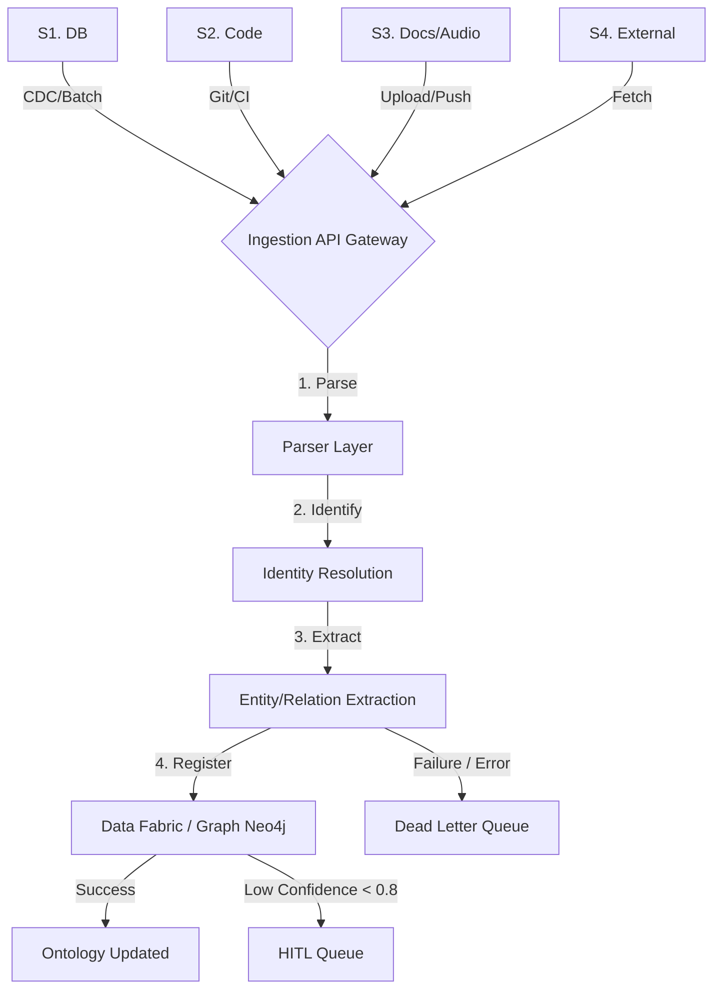

# 4-Source Ingestion Architecture (전사 수집 표준)

Axiom 플랫폼은 엔터프라이즈의 완벽한 디지털 트윈 및 온톨로지 지식 그래프 구축을 위해 4대 핵심 소스를 정의하고, 이를 단일 파이프라인 규약(Ingestion Standard)으로 통일합니다. 이 문서는 각기 다른 모듈(Weaver, Synapse 등)에 흩어진 수집 경로를 전사 관점에서 통합 관리하는 지침을 제공합니다.

## 1. 4대 핵심 Ingestion Source

| Source Type | Data Format | 담당 모듈 | 연결 방식 | 주요 목적 |
|---|---|---|---|---|
| **S1. 관계형 DB (RDBMS)** | SQL/Table Data | Weaver (MindsDB) | 주기적 Polling, CDC | 정형 데이터 계보 추적, 트랜잭션 기록 수집 |
| **S2. 레거시 코드 (Legacy Code)** | Java, PL-SQL, C# 등 | Synapse (AST Parser) | Git Webhook / 배치 | 비즈니스 로직(Invariant, Policy) 디스커버리 |
| **S3. 공식 문서 / 음성** | PDF, PPT, Word, Audio | Synapse (Extraction) | 수동 업로드 / API Push | 사내 규정(SOP), 회의록 기반 프로세스 모델링 |
| **S4. 외부 레퍼런스 / 표준** | JSON, XML, REST API | Core / Oracle | 주기적 API Fetch | 산업 표준 온톨로지, 환율, 외부 지표 지식 융합 |

## 2. 통합 Ingestion Flow (공통 파이프라인)

어떤 데이터 소스든 Axiom에 진입할 때는 다음의 공통 파이프라인(P-I-E-R)을 거쳐야 합니다.

### 2.1 공통 단계 명세
1. **Parse & Mask (파싱 및 보안)**: 텍스트 분리, 코드 AST화, STT 변환 및 주민/금융번호 PII 마스킹.
2. **Identity Resolution (식별자 병합)**: 서로 다른 소스에서 온 동일 엔티티 식별 (예: DB의 `user_id=123`과 회의록의 "홍길동 부장" 병합).
3. **Extraction & Typing (추출 및 타입화)**: GPT-4o 및 Rule 엔진 기반의 4계층(Resource-Process-Measure-KPI) 타입 부여. 
4. **Registration (등록 및 계보 생성)**: Neo4j에 그래프 노드로 저장하며, **필수 라우팅 메타데이터**를 포함.

## 3. 메타데이터 계보(Lineage) 및 무결성 필드 보장

모든 Ingestion 결과물(Graph Node, DataSource Record)에는 추적을 위한 **최소 5대 마커**가 포함되어야 합니다.

- `source_origin`: 원천 시스템 URL 또는 Git Commit Hash, 파일 스토리지 경로.
- `ingestion_timestamp`: 수집 완료 UTC 시각.
- `confidence_score`: 파싱/추출 시스템이 평가한 신뢰도 (0.0~1.0).
- `lineage_path`: 4 Source 계보 노드 식별자 배열 (예: `[DB_PostgreSQL_IP, Table_Users, Row_15]`).
- `idempotency_key`: 동일 데이터 중복 수집을 막기 위한 해시값.

## 4. 예외 및 복구 (DLQ 및 Retry)
- **Retry 정책**: 일시적 네트워크/API 실패 시 Exponential Backoff (최대 3회).
- **DLQ (Dead Letter Queue)**: 형식 오류, 마스킹 실패, PII 검출 초과 등 치명적 오류 파편은 DLQ (Redis Stream `axiom:dlq:ingest`) 로 라우팅.
- **Circuit Breaker**: 타겟 소스 서버의 연속된 타임아웃 발생 시, 특정 S(Source) 노드의 수집을 일시 차단(Open)하여 시스템 리소스 고갈 방지.
